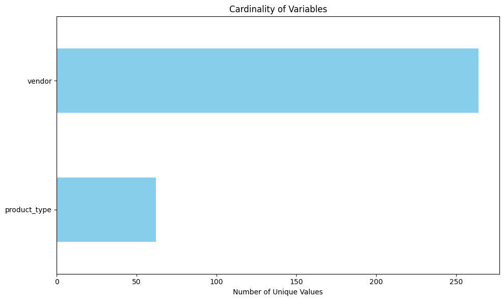
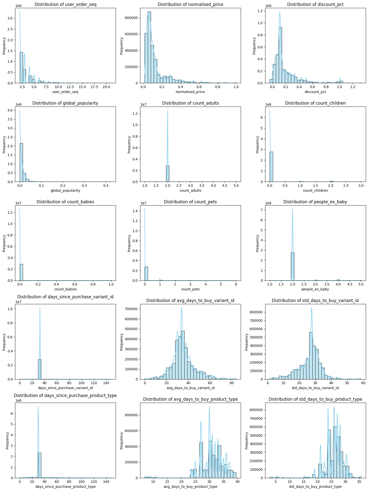
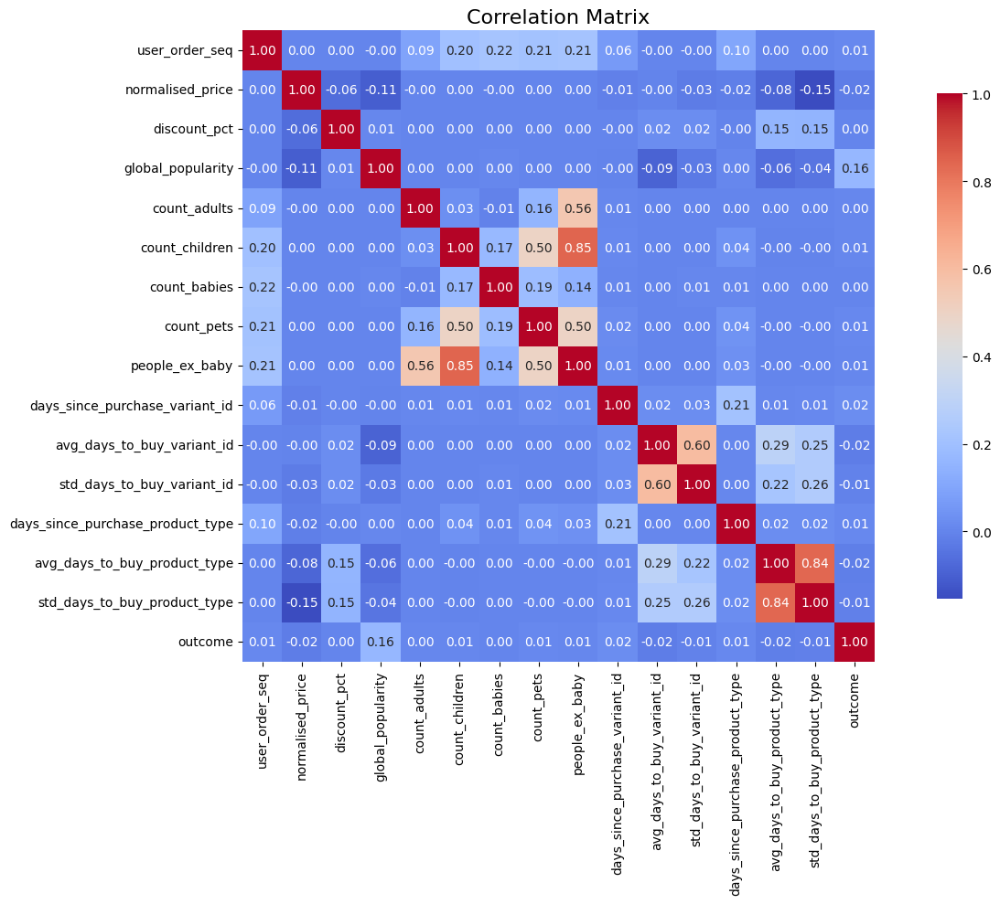

# Module 2: EDA Ready to use dataset


```python
import pandas as pd
import numpy as np

dataset = pd.read_csv('groceries_datasets2/raw/feature_frame.csv')
dataset.info()
dataset.sample(5)
```

    <class 'pandas.core.frame.DataFrame'>
    RangeIndex: 2880549 entries, 0 to 2880548
    Data columns (total 27 columns):
     #   Column                            Dtype  
    ---  ------                            -----  
     0   variant_id                        int64  
     1   product_type                      object 
     2   order_id                          int64  
     3   user_id                           int64  
     4   created_at                        object 
     5   order_date                        object 
     6   user_order_seq                    int64  
     7   outcome                           float64
     8   ordered_before                    float64
     9   abandoned_before                  float64
     10  active_snoozed                    float64
     11  set_as_regular                    float64
     12  normalised_price                  float64
     13  discount_pct                      float64
     14  vendor                            object 
     15  global_popularity                 float64
     16  count_adults                      float64
     17  count_children                    float64
     18  count_babies                      float64
     19  count_pets                        float64
     20  people_ex_baby                    float64
     21  days_since_purchase_variant_id    float64
     22  avg_days_to_buy_variant_id        float64
     23  std_days_to_buy_variant_id        float64
     24  days_since_purchase_product_type  float64
     25  avg_days_to_buy_product_type      float64
     26  std_days_to_buy_product_type      float64
    dtypes: float64(19), int64(4), object(4)
    memory usage: 593.4+ MB


<div>
<style scoped>
    .dataframe tbody tr th:only-of-type {
        vertical-align: middle;
    }

    .dataframe tbody tr th {
        vertical-align: top;
    }

    .dataframe thead th {
        text-align: right;
    }
</style>
<table border="1" class="dataframe">
  <thead>
    <tr style="text-align: right;">
      <th></th>
      <th>variant_id</th>
      <th>product_type</th>
      <th>order_id</th>
      <th>user_id</th>
      <th>created_at</th>
      <th>order_date</th>
      <th>user_order_seq</th>
      <th>outcome</th>
      <th>ordered_before</th>
      <th>abandoned_before</th>
      <th>...</th>
      <th>count_children</th>
      <th>count_babies</th>
      <th>count_pets</th>
      <th>people_ex_baby</th>
      <th>days_since_purchase_variant_id</th>
      <th>avg_days_to_buy_variant_id</th>
      <th>std_days_to_buy_variant_id</th>
      <th>days_since_purchase_product_type</th>
      <th>avg_days_to_buy_product_type</th>
      <th>std_days_to_buy_product_type</th>
    </tr>
  </thead>
  <tbody>
    <tr>
      <th>2441087</th>
      <td>33719435788420</td>
      <td>haircare</td>
      <td>2926432682116</td>
      <td>3487992971396</td>
      <td>2021-02-20 10:41:47</td>
      <td>2021-02-20 00:00:00</td>
      <td>8</td>
      <td>0.0</td>
      <td>0.0</td>
      <td>0.0</td>
      <td>...</td>
      <td>0.0</td>
      <td>0.0</td>
      <td>1.0</td>
      <td>5.0</td>
      <td>33.0</td>
      <td>34.5</td>
      <td>51.264022</td>
      <td>77.0</td>
      <td>32.0</td>
      <td>28.189363</td>
    </tr>
    <tr>
      <th>1167578</th>
      <td>34221708247172</td>
      <td>dishwasherdetergent</td>
      <td>2913137197188</td>
      <td>3812965056644</td>
      <td>2021-02-03 19:22:13</td>
      <td>2021-02-03 00:00:00</td>
      <td>7</td>
      <td>0.0</td>
      <td>0.0</td>
      <td>0.0</td>
      <td>...</td>
      <td>0.0</td>
      <td>0.0</td>
      <td>0.0</td>
      <td>4.0</td>
      <td>33.0</td>
      <td>36.0</td>
      <td>21.595392</td>
      <td>20.0</td>
      <td>32.0</td>
      <td>25.841947</td>
    </tr>
    <tr>
      <th>973614</th>
      <td>34284955402372</td>
      <td>wipescottonwool</td>
      <td>3638755000452</td>
      <td>3869957292164</td>
      <td>2021-02-25 09:58:37</td>
      <td>2021-02-25 00:00:00</td>
      <td>2</td>
      <td>0.0</td>
      <td>0.0</td>
      <td>0.0</td>
      <td>...</td>
      <td>0.0</td>
      <td>0.0</td>
      <td>0.0</td>
      <td>2.0</td>
      <td>33.0</td>
      <td>35.0</td>
      <td>22.234037</td>
      <td>30.0</td>
      <td>34.0</td>
      <td>27.826713</td>
    </tr>
    <tr>
      <th>1419634</th>
      <td>33826460008580</td>
      <td>ricepastapulses</td>
      <td>2833910923396</td>
      <td>3780814897284</td>
      <td>2020-11-07 11:19:31</td>
      <td>2020-11-07 00:00:00</td>
      <td>2</td>
      <td>0.0</td>
      <td>0.0</td>
      <td>0.0</td>
      <td>...</td>
      <td>0.0</td>
      <td>0.0</td>
      <td>0.0</td>
      <td>2.0</td>
      <td>33.0</td>
      <td>38.0</td>
      <td>28.432376</td>
      <td>30.0</td>
      <td>30.0</td>
      <td>24.276180</td>
    </tr>
    <tr>
      <th>648351</th>
      <td>33667184492676</td>
      <td>juicesquash</td>
      <td>2919373340804</td>
      <td>3767028908164</td>
      <td>2021-02-11 13:04:57</td>
      <td>2021-02-11 00:00:00</td>
      <td>6</td>
      <td>0.0</td>
      <td>0.0</td>
      <td>0.0</td>
      <td>...</td>
      <td>0.0</td>
      <td>0.0</td>
      <td>0.0</td>
      <td>2.0</td>
      <td>33.0</td>
      <td>64.0</td>
      <td>28.198095</td>
      <td>30.0</td>
      <td>27.0</td>
      <td>25.876853</td>
    </tr>
  </tbody>
</table>
<p>5 rows × 27 columns</p>
</div>


First, I check that there are no nulls in the dataset.


```python
dataset.isnull().sum()
```


    variant_id                          0
    product_type                        0
    order_id                            0
    user_id                             0
    created_at                          0
    order_date                          0
    user_order_seq                      0
    outcome                             0
    ordered_before                      0
    abandoned_before                    0
    active_snoozed                      0
    set_as_regular                      0
    normalised_price                    0
    discount_pct                        0
    vendor                              0
    global_popularity                   0
    count_adults                        0
    count_children                      0
    count_babies                        0
    count_pets                          0
    people_ex_baby                      0
    days_since_purchase_variant_id      0
    avg_days_to_buy_variant_id          0
    std_days_to_buy_variant_id          0
    days_since_purchase_product_type    0
    avg_days_to_buy_product_type        0
    std_days_to_buy_product_type        0
    dtype: int64


 Check that there is no mixing of data types in the columns of the dataset.


```python
for column in dataset.columns:
    mixed_types = dataset[column].apply(type).nunique() > 1
    if mixed_types:
        print(f"Column '{column}' has mixed type data.")

```

Then I analyse what kind of variables are in the dataset


```python
info_cols = ['variant_id', 'order_id', 'user_id', 'created_at', 'order_date']
label_col = 'outcome'
features_cols = [col for col in dataset.columns if col not in info_cols + [label_col]]

categorical_cols = ['product_type', 'vendor']
binary_cols = ['ordered_before', 'abandoned_before', 'active_snoozed', 'set_as_regular']
numerical_cols = [col for col in features_cols if col not in categorical_cols + binary_cols]
```

I analyse the outputs and I find that this is a highly unbalanced dataset.


```python
dataset[label_col].value_counts()
```


    outcome
    0.0    2847317
    1.0      33232
    Name: count, dtype: int64


Analyse cardinality of categorical variables


```python
cardinality = dataset[categorical_cols].nunique().sort_values()

import matplotlib.pyplot as plt
plt.figure(figsize=(10, 6))
cardinality.plot(kind='barh', color='skyblue')
plt.xlabel("Number of Unique Values")
plt.title("Cardinality of Variables")
plt.tight_layout()
plt.show()
```


    

    


As the cardinality is very high we will have to use frequency or target encoding.

Analyse the distribution of numerical variables


```python
import matplotlib.pyplot as plt
import seaborn as sns
import numpy as np

cols = 3
rows = int(np.ceil(len(numerical_cols) / cols))

plt.figure(figsize=(cols * 5, rows * 4))

for i, col in enumerate(numerical_cols):
    plt.subplot(rows, cols, i + 1)
    sns.histplot(dataset[col], kde=True, bins=30, color='skyblue')
    plt.title(f'Distribution of {col}')
    plt.xlabel(col)
    plt.ylabel('Frequency')

plt.tight_layout()
plt.show()

```


    

    


Some peaks stand out in these distributions, suggesting that there has been an imputation of data to the median or mode on variables such as count_children, where we knew from the task 1 dataset that most of the data were missing.

Let's check the correlation of the numerical variables


```python
import numpy as np
import seaborn as sns
import matplotlib.pyplot as plt

corr = dataset[numerical_cols + [label_col]].corr()

plt.figure(figsize=(15, 10))
sns.heatmap(corr, annot=True, fmt=".2f", cmap="coolwarm", square=True, cbar_kws={"shrink": .8})
plt.title("Correlation Matrix", fontsize=16)
plt.tight_layout()
plt.show()
```


    

    


We found nothing outstanding in the correlation matrix, the variables are moderately correlated.
